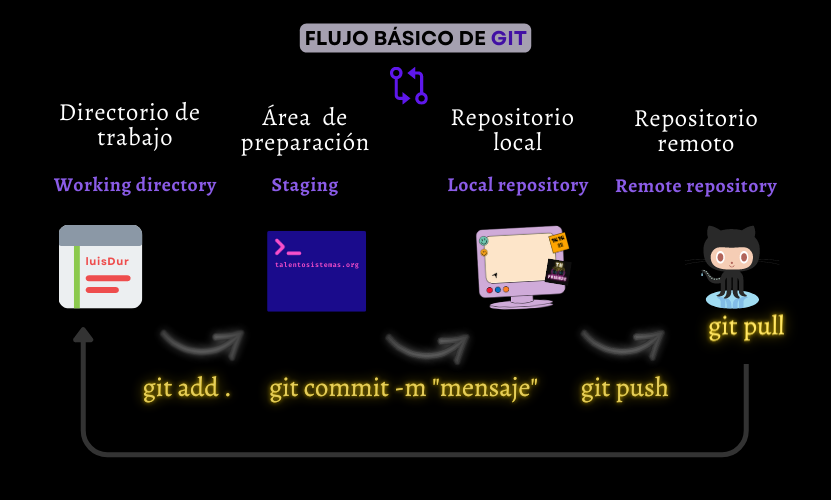
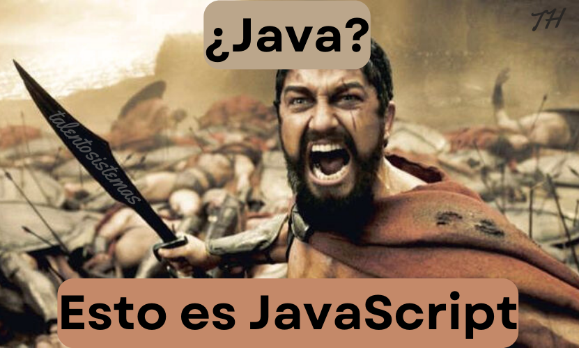

# _BootCamp_ de Desarrollo _Web Full Stack_

## Contenido de este Repositorio

1. [Introducción](#introducción)
1. [Terminal de Comandos](#terminal-de-comandos)
1. [_Git/GitHub_](#gitgithub)
1. [_HTML_](#html)
1. _VSC_
1. _CSS_
1. _Markdown_
1. _Bootstrap_
1. [_JavaScript_](#javascript)
1. _TypeScript_
1. _SASS_
1. _APIs_
1. _AJAX_
1. _JSON_
1. _jQuery_
1. _POO_
1. _PHP_
1. _Node_
1. _React_
1. _React Native_
1. _Express_
1. _SQL_
1. _Testing_ Básico
1. _Deploy_ Básico
1. _Scrum_ Básico
1. _AWS_ Básico
1. _Soft Skills_ Básicas

---

## Introducción

### ¿Por qué creamos este proyecto?

Nuestra intención es ponerte el inicio de tu camino como _dev_ mucho más sencillo.

### ¿Como recomendamos usar este repo?

Simple, con dedicarle 3 días a la semana a estudiarlo, es decir, lees y lo pones en practica, tal vez por una o dos horas el día que lo estudies, irás bien. El aprendizaje real se dará solo si comienzas a crear proyectos con este conocimiento.

Te animo a consultar la fecha de las próximas clases en la seeción de Avisos o en cualquiera de nuestras redes sociales.
¡Gracias por estar aquí! 🙂

---

## Preguntas Comunes

### ¿Qué es un _BootCamp_?

Un _BootCamp_ es un programa de formación intensiva en el que se enseñan las habilidades técnicas que demanda el mercado laboral.

### ¿Qué es un _Full Stack_?

Un _Full Stack_ es un profesional capaz de desarrollar aplicaciones web tanto en el _Frontend_ como en el _Backend_.

### ¿Qué es el _Frontend_?

El _Frontend_ es la parte de la aplicación web que interactúa con los usuarios.

### ¿Qué es el _Backend_?

El _Backend_ es la parte de la aplicación web que interactúa con el servidor.

### ¿Qué es un _Stack_?

Un _Stack_ es un conjunto de tecnologías que se utilizan para desarrollar una aplicación web.

### ¿Por qué aprender a programar?

Porque la programación es el presente y el futuro.

### ¿Por qué aprender a programar en _JavaScript_?

Porque _JavaScript_ es el lenguaje de programación más popular del mundo.

### ¿Qué es _JavaScript_?

_JavaScript_ es un lenguaje de programación que se utiliza para desarrollar aplicaciones web.

### ¿Qué es una aplicación web?

Una aplicación web es un programa que se ejecuta en un servidor y que se utiliza a través de un navegador web.

### ¿Qué es un servidor?

Un servidor es un ordenador que se utiliza para almacenar y ejecutar programas.

### ¿Qué es un navegador web?

Un navegador web es un programa que se utiliza para acceder a aplicaciones web.

### ¿Qué es un programa?

Un programa es un conjunto de instrucciones que se ejecutan en un ordenador.

### ¿Qué es un ordenador?

Un ordenador es una máquina que se utiliza para procesar información.

### ¿Qué es un lenguaje de programación?

Un lenguaje de programación es un conjunto de reglas que se utilizan para escribir programas.

---

## Terminal de Comandos

En el sistema operativo _Windows_, recomendamos usar la terminal que tiene _Git_, al instalarlo en tu equipo en ocaciones te pregunta si quieres instalar _Git Bash_, esa es la terminal que recomendamos. _Git Bash_ es la terminal que más estandariza los comandos de los diferentes sistemas operativos.

### Comandos básicos

| Comando  | Descripción                                |
| -------- | ------------------------------------------ |
| `pwd`    | directorio actual                          |
| `ls`     | muestra los archivos del directorio actual |
| `cd X`   | cambia al directorio X directorio          |
| `touch`  | crea un archivo                            |
| `mkdir`  | crea un nuevo directorio                   |
| `rm`     | elimina un archivo                         |
| `rmdir`  | elimina un directorio vacío                |
| `code`   | abre VSC                                   |
| `code .` | abre esta carpeta en VSC                   |
| `vim`    | abre Vim                                   |
| `clear`  | limpiar la terminal                        |

### Símbolos

| Comando | Descripción                            |
| ------- | -------------------------------------- |
| `.`     | directorio actual                      |
| `..`    | directorio padre / directorio superior |
| `~`     | directorio home: c/Users/usuario       |

---

## _Git/GitHub_

### Importante

> ### _Git ≠ GitHub_

Se suele pensar que son lo mismo, tal vez se deba al hecho de que solemos escribirlos pegados con una barra diagonal.

### _Git_

Es por mucho el software de **control de versiones** más ocupado del mundo.
Las versiones se guardan de manera local, en tu equipo de computo.

[Página oficial](https://git-scm.com)

### _GitHub_

Es el **control de versiones** remoto más ocupado del mundo.
Las versiones se guardan de manera remota, en su página web.

[Página oficial](https://github.com)

//En Construcción...

---

## _HTML_

Lenguaje de marcas de hipertexto.

> Sin _HTML_ no hay _web_.

Es el lenguaje más básico de la _web_.

> ¡Ojo! _HTML_ sí es un lenguaje, pero no de programación.

Pensemos que para ser un lenguaje de programación se requiere que dicho lenguaje tenga funciones.

_Ok_, su función principal es: ser
el encargado de la estructura de una página _web_.

//En Construcción...

---

## _VSC_

//En Construcción...

---

## _CSS_

//En Construcción...

---

## _Markdown_

//En Construcción...

---

## _Bootstrap_

//En Construcción...

---

## _JavaScript_

### Importante

> ### _JavaScript ≠ Java_

También conocido por sus siglas _JS_, fue desarrollado el 1995 por Brendan Eich.

### _ECMAScript_

También conocido como _ES_, es un estándar de lenguaje de programación que especifica cómo deben funcionar los scripts en un entorno de programación.
Fue creado para estandarizar el lenguaje JavaScript, que se utiliza ampliamente en la programación _web_.

_ECMAScript_ define la sintaxis, estructuras de datos, tipos y funcionalidades del lenguaje JavaScript. Está diseñado para ser implementado en diferentes entornos, como navegadores web y servidores, y permite a los desarrolladores escribir código JavaScript compatible que funcione de manera consistente en diferentes plataformas.

Cada versión de ECMAScript introduce nuevas características y mejoras al lenguaje JavaScript. Las versiones más conocidas de ECMAScript son ECMAScript 5 (lanzado en 2009), ECMAScript 6 (también conocido como ES6 o ES2015, lanzado en 2015) y ECMAScript 2015 (ES2015).

ECMAScript ha tenido un impacto significativo en el desarrollo web, ya que ha permitido a los desarrolladores crear aplicaciones web más interactivas y dinámicas. Además, ha impulsado la adopción de tecnologías como Node.js, que permite ejecutar código JavaScript en el servidor.

### Isomorfismo

El isomorfismo, de manera simple, es una relación entre dos cosas que tienen la misma forma pero pueden ser diferentes en otros aspectos.

_JS_ puede ejecutarse tanto en el _**Frontend**_ como en el _**Backend**_.

Y no solo puedes trabajar en la _Web_, sino también en:

- Diseño y Desarrollo Web
- Videojuegos
- Experiencia 3D
- Realidad Aumentada
- Realidad Virtual
- Controlar Hardware
- Aplicaciones Híbridas y Móviles
- Machine Learning
- ...

### Características

- Lenguaje de alto nivel
- Interpretado
- Dinámico
- Tipado Débil
- Multiparadigma
- El punto y coma al final de la línea es opcional
- Case Sensitive: sensible a Mayúsculas y minúsculas
- Es costumbre usar CamelCase para escribir los nombres de las variables

### Tipos de Datos

#### Los Fundamentales o Primitivos

> - string
> - number
> - boolean
> - null
> - undefined
> - NaN

#### Los Secundarios o Compuestos

> - object = {}
> - array = []
> - function () { }
> - Class {}
> - ...

//En Construcción...

---
