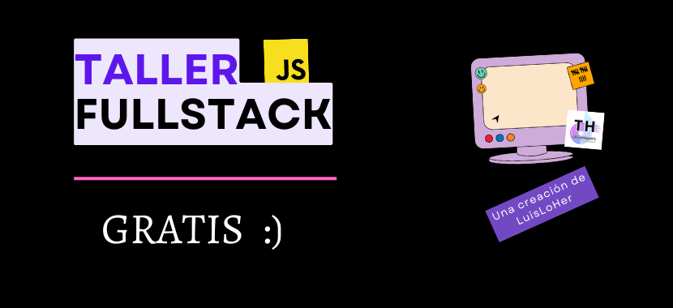
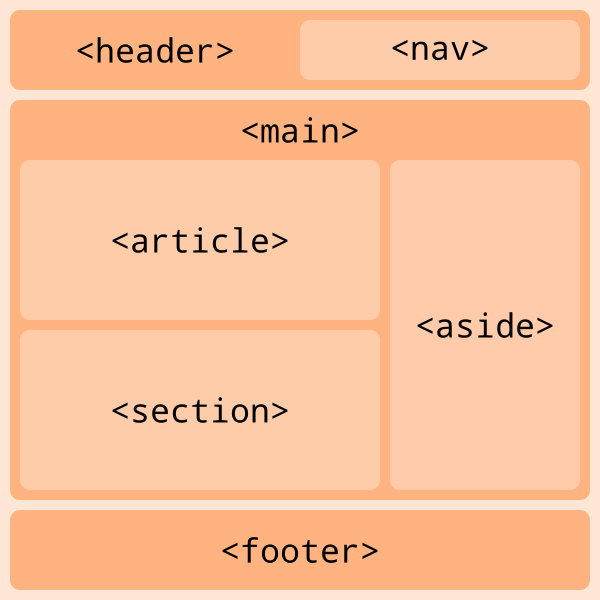
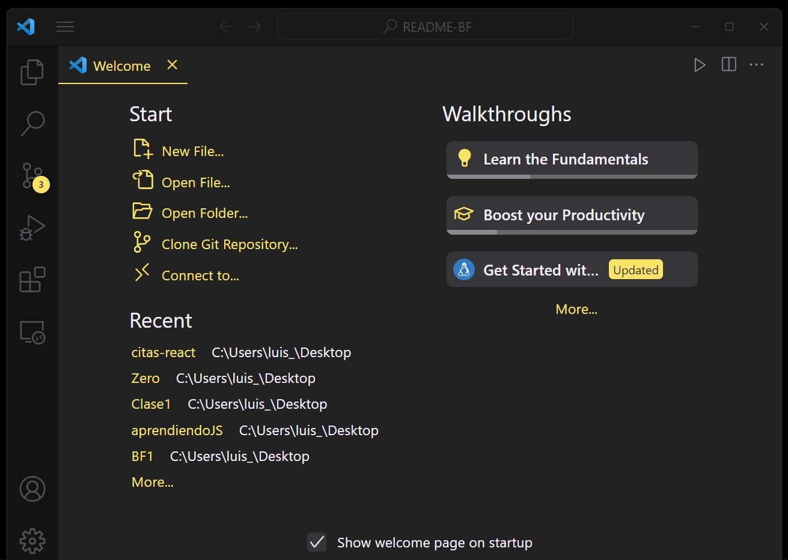

# Taller de Desarrollo _Web Full Stack_



## Contenido de este Repositorio

1. [Introducción](#introducción)
1. [Terminal de Comandos](#terminal-de-comandos)
1. [_Git/GitHub_](#gitgithub)
1. [_HTML_](#html)
1. [_VSC_](#vsc)
1. [_CSS_](#css)
1. _Markdown_
1. _Bootstrap_
1. [_JavaScript_](#javascript)
1. _TypeScript_
1. _SASS_
1. _APIs_
1. _AJAX_
1. _JSON_
1. _jQuery_
1. _POO_
1. _PHP_
1. _Node_
1. [_React_](#react)
1. _React Native_
1. _Express_
1. [_SQL_](#sql)
1. _Testing_ Básico
1. _Deploy_ Básico
1. _Scrum_ Básico
1. _AWS_ Básico
1. _Soft Skills_ Básicas

---

## Introducción

### ¿Por qué creamos este proyecto?

Nuestra intención es ponerte el inicio de tu camino como _dev_ mucho más sencillo.

### ¿Como recomendamos usar este repo?

Simple, con dedicarle 3 días a la semana a estudiarlo, es decir, lees y lo pones en practica, tal vez por una o dos horas al día que lo estudies, irás bien. El aprendizaje real se dará solo si comienzas a crear proyectos con este conocimiento.

Te animo a consultar la fecha de las próximas clases en la seeción de Avisos o en cualquiera de nuestras redes sociales.
¡Gracias por estar aquí! 🙂

---

## Preguntas Comunes

### ¿Qué es un _BootCamp_?

Un _BootCamp_ es un programa de formación intensiva en el que se enseñan las habilidades técnicas que demanda el mercado laboral.

### ¿Qué es un _Full Stack_?

Un _Full Stack_ es un profesional capaz de desarrollar aplicaciones web tanto en el _Frontend_ como en el _Backend_.

### ¿Qué es el _Frontend_?

El _Frontend_ es la parte de la aplicación web que interactúa con los usuarios.

### ¿Qué es el _Backend_?

El _Backend_ es la parte de la aplicación web que interactúa con el servidor.

### ¿Qué es un _Stack_?

Un _Stack_ es un conjunto de tecnologías que se utilizan para desarrollar una aplicación web.

### ¿Por qué aprender a programar?

Porque la programación es el presente y el futuro.

### ¿Por qué aprender a programar en _JavaScript_?

Porque _JavaScript_ es el lenguaje de programación más popular del mundo.

### ¿Qué es _JavaScript_?

_JavaScript_ es un lenguaje de programación que se utiliza para desarrollar aplicaciones web.

### ¿Qué es una aplicación web?

Una aplicación web es un programa que se ejecuta en un servidor y que se utiliza a través de un navegador web.

### ¿Qué es un servidor?

Un servidor es un ordenador que se utiliza para almacenar y ejecutar programas.

### ¿Qué es un navegador web?

Un navegador web es un programa que se utiliza para acceder a aplicaciones web.

### ¿Qué es un programa?

Un programa es un conjunto de instrucciones que se ejecutan en un ordenador.

### ¿Qué es un ordenador?

Un ordenador es una máquina que se utiliza para procesar información.

### ¿Qué es un lenguaje de programación?

Un lenguaje de programación es un conjunto de reglas que se utilizan para escribir programas.

---

## Terminal de Comandos

En el sistema operativo _Windows_, recomendamos usar la terminal que tiene _Git_, al instalarlo en tu equipo en ocaciones te pregunta si quieres instalar _Git Bash_, esa es la terminal que recomendamos. _Git Bash_ es la terminal que más estandariza los comandos de los diferentes sistemas operativos.

### Comandos básicos

| Comando  | Descripción                                |
| -------- | ------------------------------------------ |
| `pwd`    | directorio actual                          |
| `ls`     | muestra los archivos del directorio actual |
| `cd X`   | cambia al directorio X directorio          |
| `touch`  | crea un archivo                            |
| `mkdir`  | crea un nuevo directorio                   |
| `rm`     | elimina un archivo                         |
| `rmdir`  | elimina un directorio vacío                |
| `code`   | abre VSC                                   |
| `code .` | abre esta carpeta en VSC                   |
| `vim`    | abre Vim                                   |
| `clear`  | limpiar la terminal                        |

### Símbolos

| Comando | Descripción                            |
| ------- | -------------------------------------- |
| `.`     | directorio actual                      |
| `..`    | directorio padre / directorio superior |
| `~`     | directorio home: c/Users/usuario       |

---

## _Git/GitHub_

### Importante

> ### _Git ≠ GitHub_

Se suele pensar que son lo mismo, tal vez se deba al hecho de que solemos escribirlos pegados con una barra diagonal.

### _Git_

Es por mucho el software de **control de versiones** más ocupado del mundo.
Las versiones se guardan de manera local, en tu equipo de computo.

[Página oficial](https://git-scm.com)

### _GitHub_

Es el **control de versiones** remoto más ocupado del mundo.
Las versiones se guardan de manera remota, en su página web.

[Página oficial](https://github.com)


//En Construcción...

---

## _HTML_

Lenguaje de marcas de hipertexto.

> Sin _HTML_ no hay _web_.

Es el lenguaje más básico de la _web_.

> ¡Ojo! _HTML_ sí es un lenguaje, pero no de programación.

Pensemos que para ser un lenguaje de programación se requiere que dicho lenguaje tenga funciones.

_Ok_, su función principal es: ser
el encargado de la estructura de una página _web_.

### Estructurar el contenido

#### Estructura general de una página



### Etiquetas para estructurar/agrupar el contenido

| Etiqueta  | Descripción         |
| --------- | ------------------- |
| `header`  | parte superior      |
| `nav`     | barra de navegación |
| `main`    | contenido principal |
| `section` | una sección         |
| `article` | entrada de blog     |
| `aside`   | barra lateral       |
| `footer`  | parte inferior      |
| `div`     | contenedor genérico |

### Etiquetas para crear el contenido

| Etiqueta | Información de uso                                      | Etiqueta padre                                            |
| -------- | ------------------------------------------------------- | --------------------------------------------------------- |
| `h1`     | título principal, solo usar una vez por documento HTML. | `header`, también podría ser `main` o `section` (o `div`) |
| `h2`     | título secundario, de nivel 2                           | `main` o `section` (o `div`)                              |
| `h3`     | título de nivel 3                                       | `section` (o `div`)                                       |
| `h4`     | título de nivel 4, casi no se usa                       | `section` (o `div`)                                       |
| `h5`     | título de nivel 5, rara vez se usa uso                  | `section` (o `div`)                                       |
| `h6`     | título de nivel 6, es muy raro que se utilice           | `section` (o `div`)                                       |
| `p`      | párrafo, la etique más usada                            | cualquier etiqueta de estructura                          |
| `title`  | nombre de la pestaña actual de la página                | cualquier etiqueta de estructura                          |
| `a`      | _anchor_/ancla, enlace                                  | `head`                                                    |
| `title`  | nombre de la pestaña actual de la página                | `head`                                                    |
| `title`  | nombre de la pestaña actual de la página                | `head`                                                    |
| `title`  | nombre de la pestaña actual de la página                | `head`                                                    |
| `title`  | nombre de la pestaña actual de la página                | `head`                                                    |
| `title`  | nombre de la pestaña actual de la página                | `head`                                                    |

### Enlaces

La etiqueta `<a>` se utiliza para crear enlaces o hipervínculos en una página _web_, permitiendo a los usuarios navegar entre diferentes páginas o recursos en la _web_ con solo hacer clic en el enlace.

El atributo principal de la etiqueta `<a>` es el atributo `href`, que especifica la dirección URL de destino del enlace.

Aquí está la sintaxis básica de la etiqueta `<a>`:

`<a href="URL_del_destino"> Texto del enlace </a>`

`href`: Este atributo es obligatorio y define la dirección URL de destino del enlace. Puede apuntar a una página _web_, un archivo, una dirección de correo electrónico o cualquier otro recurso accesible mediante una URL. Al hacer clic en el enlace, el navegador redirige al usuario a la URL especificada en el atributo `href`.

`target`: Este atributo opcional define cómo se abrirá el enlace cuando se hace clic. Los valores más comunes son `_blank`, que abre el enlace en una nueva ventana o pestaña del navegador, y `_self`, que abre el enlace en la misma ventana o pestaña del navegador en la que se encuentra el enlace (esta es la opción predeterminada si no se especifica nada).

Ejemplo para abrir el enlace en una nueva pestaña:

Algunos ejemplos sencillos de diferentes valores para el atributo `href` en la etiqueta `<a>`:

`<a href="https://www.ejemplo.com" target="_blank">Abrir enlace en nueva pestaña</a>`

`download`: Este atributo opcional se usa cuando el enlace apunta a un archivo descargable. Si se agrega el atributo `download`, el navegador sugerirá al usuario que descargue el archivo en lugar de abrirlo directamente.

`rel`: Otro atributo opcional que especifica la relación del enlace con la página actual. Un uso común es `rel="nofollow"`, que indica a los motores de búsqueda que no sigan el enlace y, por lo tanto, no influya en el _ranking_ del enlace para SEO.

`title`: Atributo opcional que proporciona un texto descriptivo o una información adicional sobre el enlace cuando el usuario pasa el cursor sobre él (hace un "_hover_").

**Dos formas de crear un botón**

`<a href="">Clic</a>`

`<button type="button">Clic</button>`

//En Construcción...

---

## _VSC_



Visual Studio Code es un editor de código fuente desarrollado por Microsoft para Windows, Linux, macOS y Web.

Incluye soporte para la depuración, control integrado de Git, resaltado de sintaxis, finalización inteligente de código, fragmentos y refactorización de código.

Básicamente es el mejor editor de código de la actualidad, usado principalmente para Desarrollo _Web_.
Su preferencia se debe al gran número de extensiones que admite.

[Página oficial](https://code.visualstudio.com)

//En Construcción...

---

## _CSS_

### Cascading Style Sheets (Hojas de Estilo en Cascada)

Es el código que usas para dar estilo a tu página web.

Las principales cosas en la que encarga CSS son:

- colores
- tamaños
- espacios
- fuentes
- animaciones
- adaptación a dispositivos

Es un lenguaje pero no de programación, tampoco es un lenguaje de marcado. Es un lenguaje de hojas de estilo, es decir, te permite aplicar estilos de manera selectiva a elementos en documentos HTML.

CSS es fácil, solo que tiene muchos detalles que es importante conocer.
Empezar con este lenguaje es muy sencillo, como todo es cuestión de ir avanzando de manera constante, hacer proyectos propios e investigar qué hace falta para que funcione el código en determiado apartado.

### Código CSS

```css
p {
  color: red;
}
```

La `p` hace referencia a la etiqueta `<p>` de _HTML_.
Dentro de las `{}` colocamos las acciones que le haremos a la etiqueta/selector `p`.
Las acciones las representamos con _sets_ (conjuntos) de `clave: valor` (o `llave: valor`o `propiedad: valor`)

Se dice que CSS es en cascada por lo siguiente:

```css
p {
  color: blue;
}
```

```css
p {
  color: yellow;
}
```

Si tenemos la misma propiedad aplicandose al mismo selector, va a tomar la última.

### Cómo agregar CSS

Hay 3 formas, en línea, en bloque o en un archivo separado.
Casi siempre lo mejor opción es crear un archivo externo, la instrucción es la siguiente:

```html
<link rel="stylesheet" href="style.css" />
```

### Especificidad

### Fundamentales

> Código y Descripción

Se desarrollo un truco para poder trabajar con _**rem**_ sin complicaciones.

```css
html {
  font-size: 62.5%;
}

body {
  font-size: 16px;
}
```

### Botones

```css
.boton {
  background-color: #3498db;
  color: white;
  padding: 10px 20px;
  border: none;
  border-radius: 5px;
  cursor: pointer;
}
```

```css
.boton {
  background-color: #e74c3c;
  color: white;
  padding: 10px 20px;
  border: none;
  border-radius: 5px;
  cursor: pointer;
}

.boton:hover {
  background-color: #c0392b;
}
```

//En Construcción...

---

## _Markdown_

//En Construcción...

---

## _Bootstrap_

//En Construcción...

---

## _JavaScript_

### Importante

> ### _JavaScript ≠ Java_


**Creación**

Fue desarrollado el 1995 por Brendan Eich. Este lenguaje también se representa por sus siglas _JS_,

**Nota**

> Aquí verás lo más importante de JS y de hecho, verás lo necesario para poder estudiar React 😉

### _ECMAScript_

También conocido como _ES_, es un estándar de lenguaje de programación que especifica cómo deben funcionar los scripts en un entorno de programación.
Fue creado para estandarizar el lenguaje JavaScript, que se utiliza ampliamente en la programación _web_.

_ECMAScript_ define la sintaxis, estructuras de datos, tipos y funcionalidades del lenguaje JavaScript. Está diseñado para ser implementado en diferentes entornos, como navegadores web y servidores, y permite a los desarrolladores escribir código JavaScript compatible que funcione de manera consistente en diferentes plataformas.

Cada versión de ECMAScript introduce nuevas características y mejoras al lenguaje JavaScript. Las versiones más conocidas de ECMAScript son ECMAScript 5 (lanzado en 2009), ECMAScript 6 (también conocido como ES6 o ES2015, lanzado en 2015) y ECMAScript 2015 (ES2015).

ECMAScript ha tenido un impacto significativo en el desarrollo web, ya que ha permitido a los desarrolladores crear aplicaciones web más interactivas y dinámicas. Además, ha impulsado la adopción de tecnologías como Node.js, que permite ejecutar código JavaScript en el servidor.

### Isomorfismo

El isomorfismo, de manera simple, es una relación entre dos cosas que tienen la misma forma pero pueden ser diferentes en otros aspectos.

_JS_ puede ejecutarse tanto en el _**Frontend**_ como en el _**Backend**_.

Y no solo puedes trabajar en la _Web_, sino también en:

- Diseño y Desarrollo Web
- Videojuegos
- Experiencia 3D
- Realidad Aumentada
- Realidad Virtual
- Controlar Hardware
- Aplicaciones Híbridas y Móviles
- Machine Learning
- ...

### Características

- Lenguaje de alto nivel
- Interpretado
- Dinámico
- Tipado Débil
- Multiparadigma
- El punto y coma al final de la línea es opcional
- Case Sensitive: sensible a Mayúsculas y minúsculas
- Es costumbre usar CamelCase para escribir los nombres de las variables

### Tipos de Datos

#### Los Fundamentales o Primitivos

> - string
> - number
> - boolean
> - null
> - undefined
> - NaN

#### Los Secundarios o Compuestos

> - object = {}
> - array = []
> - function () { }
> - Class {}
> - ...

//En Construcción...

---

## _React_

React es una biblioteca de JavaScript de código abierto para construir interfaces de usuario. Está basada en la componetización de la UI: la interfaz se divide en componentes independientes, que contienen su propio estado. Cuando el estado de un componente cambia, React vuelve a renderizar la interfaz.

Esto hace que React sea una herramienta muy útil para construir interfaces complejas, ya que permite dividir la interfaz en piezas más pequeñas y reutilizables.

Fue creada en 2011 por Jordan Walke, un ingeniero de software que trabajaba en Facebook y que quería simplificar la forma de crear interfaces de usuario complejas.

Es una biblioteca muy popular y es usada por muchas empresas como Facebook, Netflix, Airbnb, Twitter, Instagram, etc.

### Documentación

La documentación es una parte de nuestro trabajo como desarrolladores, que nos puede guiar en las distintas fases de desarrollo.

La documentación de los programas es un aspecto sumamente importante, tanto en el desarrollo de la aplicación como en el mantenimiento de la misma. Mucha gente no dedica tiempo a esta parte del desarrollo y no se da cuenta de que pierde la capacidad de un mantenimiento sencillo y parte de su potencial de organización del código, de una manera más flexible y escalable. Incluso la documentación puede ayudarnos a reutilizar partes de la aplicación y sobre todo de los esquemas de diseño.

### Qué es la documentación

La documentación, como su propio nombre indica, es todo tipo de información que ayuda a dirigir los esfuerzos del equipo de desarrollo y que además ayude a entender la arquitectura y diseño de la aplicación a lo largo del tiempo. De cara al cliente puede ser toda aquella información que le guíe a la hora usar la aplicación una vez entregada.

La documentación de un programa empieza a la vez que la construcción del mismo. De hecho, lo más normal es comenzar haciendo esquemas de las piezas del programa, funcionalidad, interfaces, etc. para que, en el momento que nos pongamos a programar, tengamos muy claro qué es lo que se va a desarrollar y cómo lo vamos a hacer.

La realización de la documentación no termina con la entrega de la aplicación, pues durante el mantenimiento es necesario actualizarla para reflejar los cambios que se hayan tenido que realizar para crear nuevas funcionalidades.

[Documentación oficial en español](https://es.react.dev)

### Instalación

//En Construcción...

---

## _SQL_

_SQL_ significa _Structured Query
Language_, es decir, Lenguaje Estructurado de Consultas.

Es el lenguaje más común para realizar consultas en una base de datos.
Creado en 1974.

## _MySQL_

Se llega a generar un confusión entre _SQL_ y _MySQL_, incluso también hasta con
_Workbench_.

> _SQL_ es el lenguaje de consultas.

> _MySQL_ es un sistema de gestión de bases de datos relacional.

> _Workbench_ es una herramienta visual de diseño de bases de datos.

WB que integra desarrollo de software, administración de bases de datos, diseño de bases de datos, gestión y mantenimiento para el sistema de base de datos MySQL.

```

```
