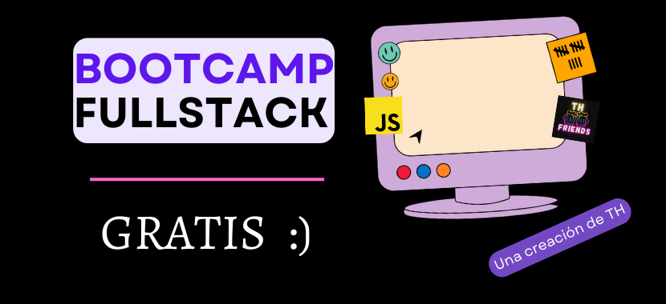

# _BootCamp_ de Desarrollo _Web Full Stack_

## Contenido de este Repositorio

1. [Introducción](#introducción)
1. [Terminal de Comandos](#terminal-de-comandos)
1. [_Git/GitHub_](#gitgithub)
1. [_HTML_](#html)
1. _VSC_
1. _CSS_
1. _Markdown_
1. _Bootstrap_
1. _JavaScript_
1. _TypeScript_
1. _SASS_
1. _APIs_
1. _AJAX_
1. _JSON_
1. _jQuery_
1. _POO_
1. _PHP_
1. _Node_
1. _React_
1. _React Native_
1. _Express_
1. _SQL_
1. _Testing_ Básico
1. _Deploy_ Básico
1. _Scrum_ Básico
1. _AWS_ Básico
1. _Soft Skills_ Básicas

---

## Introducción

## ¿Por qué creamos este proyecto?

Nuestra intención es ponerte el inicio de tu camino como _dev_ mucho más sencillo.

## ¿Como recomendamos usar este repo?

Simple, con dedicarle 3 días a la semana a estudiarlo, es decir, lees y lo pones en practica, tal vez por una o dos horas el día que lo estudies, irás bien. El aprendizaje real se dará solo si comienzas a crear proyectos con este conocimiento.

Te animo a consultar la fecha de las próximas clases en la seeción de Avisos o en cualquiera de nuestras redes sociales.
¡Gracias por estar aquí! 🙂

## Preguntas Comunes

### ¿Qué es un _BootCamp_?

Un _BootCamp_ es un programa de formación intensiva en el que se enseñan las habilidades técnicas que demanda el mercado laboral.

### ¿Qué es un _Full Stack_?

Un _Full Stack_ es un profesional capaz de desarrollar aplicaciones web tanto en el _Frontend_ como en el _Backend_.

### ¿Qué es el _Frontend_?

El _Frontend_ es la parte de la aplicación web que interactúa con los usuarios.

### ¿Qué es el _Backend_?

El _Backend_ es la parte de la aplicación web que interactúa con el servidor.

### ¿Qué es un _Stack_?

Un _Stack_ es un conjunto de tecnologías que se utilizan para desarrollar una aplicación web.

### ¿Por qué aprender a programar?

Porque la programación es el presente y el futuro.

### ¿Por qué aprender a programar en _JavaScript_?

Porque _JavaScript_ es el lenguaje de programación más popular del mundo.

### ¿Qué es _JavaScript_?

_JavaScript_ es un lenguaje de programación que se utiliza para desarrollar aplicaciones web.

### ¿Qué es una aplicación web?

Una aplicación web es un programa que se ejecuta en un servidor y que se utiliza a través de un navegador web.

### ¿Qué es un servidor?

Un servidor es un ordenador que se utiliza para almacenar y ejecutar programas.

### ¿Qué es un navegador web?

Un navegador web es un programa que se utiliza para acceder a aplicaciones web.

### ¿Qué es un programa?

Un programa es un conjunto de instrucciones que se ejecutan en un ordenador.

### ¿Qué es un ordenador?

Un ordenador es una máquina que se utiliza para procesar información.

### ¿Qué es un lenguaje de programación?

Un lenguaje de programación es un conjunto de reglas que se utilizan para escribir programas.

---

## Terminal de Comandos

### Comandos básicos

| Comando  | Descripción                                |
| -------- | ------------------------------------------ |
| `pwd`    | directorio actual                          |
| `ls`     | muestra los archivos del directorio actual |
| `cd X`   | cambia al directorio X directorio          |
| `touch`  | crea un archivo                            |
| `mkdir`  | crea un nuevo directorio                   |
| `rm`     | elimina un archivo                         |
| `rmdir`  | elimina un directorio vacío                |
| `code`   | abre VSC                                   |
| `code .` | abre esta carpeta en VSC                   |
| `vim`    | abre Vim                                   |
| `clear`  | limpiar la terminal                        |

### Símbolos

| Comando | Descripción                            |
| ------- | -------------------------------------- |
| `.`     | directorio actual                      |
| `..`    | directorio padre / directorio superior |
| `~`     | directorio home: c/Users/usuario       |

## _Git/GitHub_

## _HTML_
